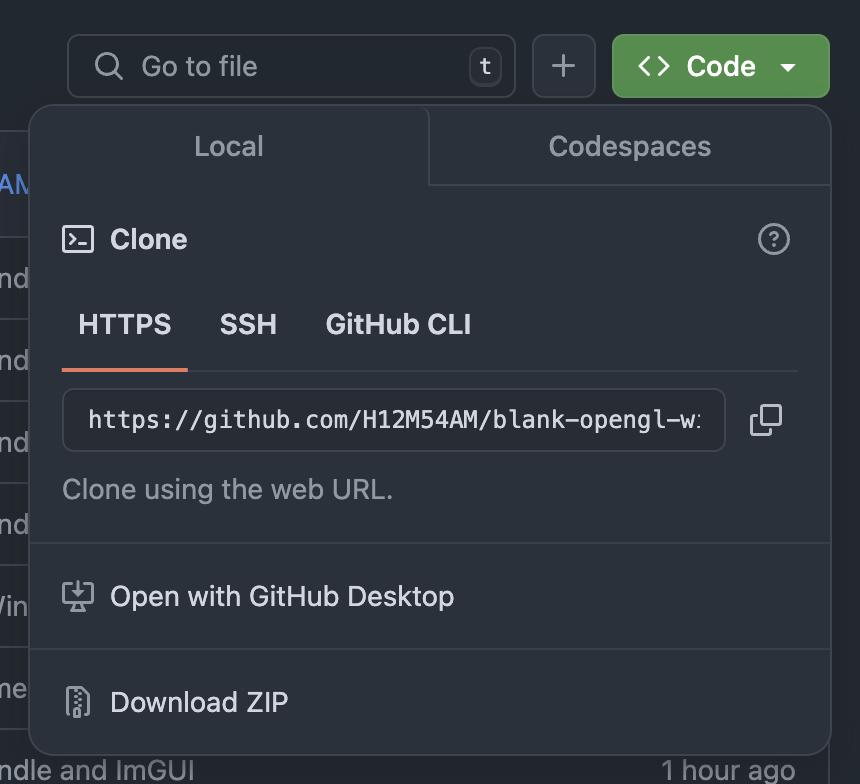
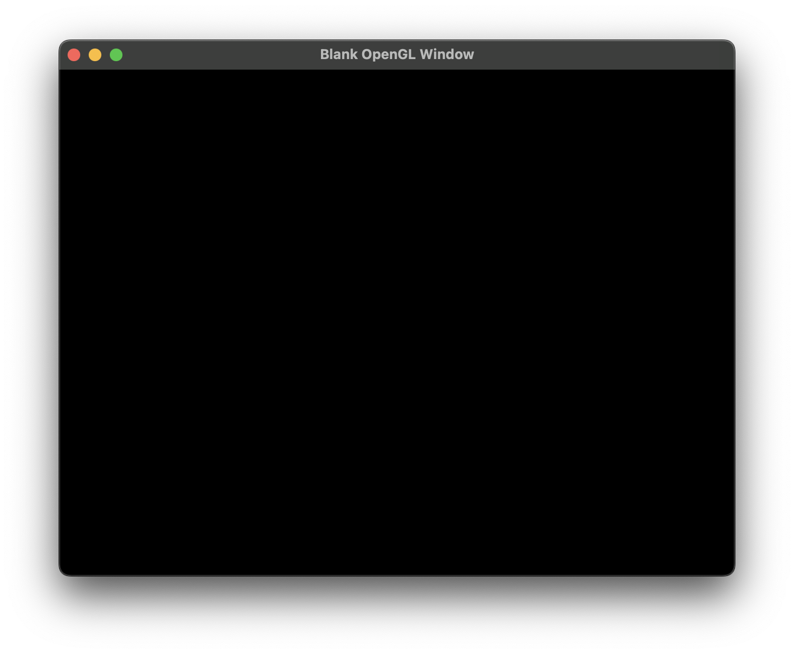
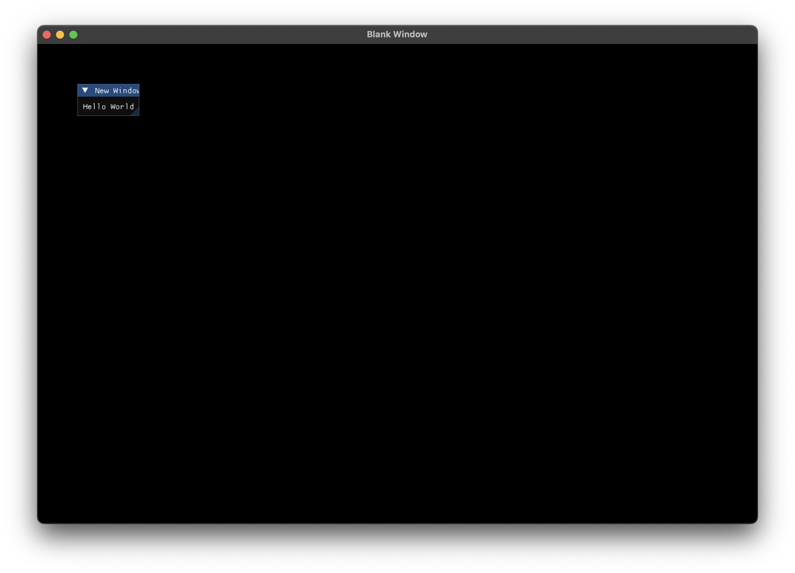
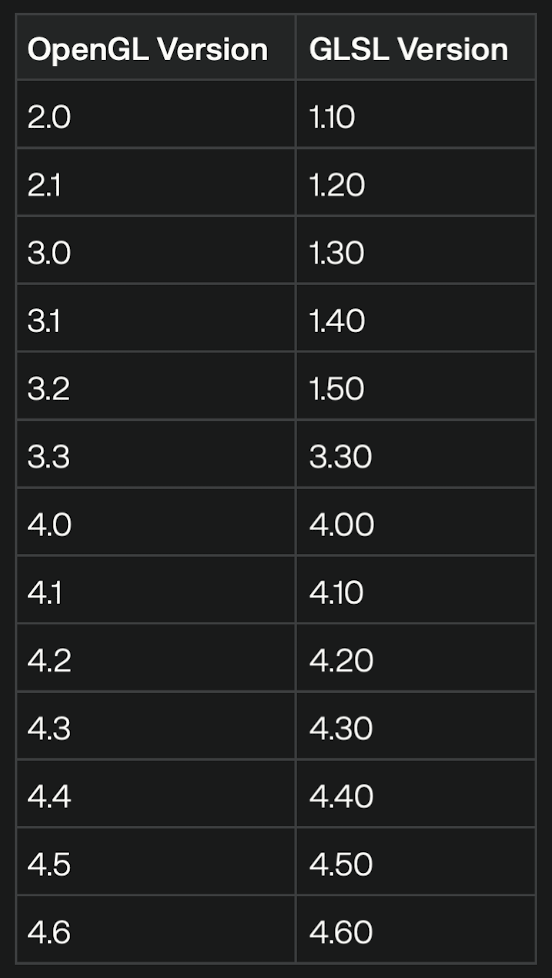

# Blank Window

## Main Goal
To create a "usable" .app window for the ARM architecture in MacOS, for MacOS. 

## Why make this project instead of using Swift in Xcode?
It is not commonly known to use this because theres swift. But Xcode is cringe. And way too big. It's just not good and using it requires a segmented mindset and physical environment becuase it requires so much storage and RAM. 

You basically need another MacOS machine for programming on Xcode using swift just to program freely without intefereing with everything else a computer is used for, including the various hobbies or interests that requires physical hardware like; Video Editing, Game Developement (Unreal Engine, Unity, etc), Music (instrumental sounds) and more. 

## Who is this project best for?
*This is not the requirement. Rather its my recommendation becuase I've tested this project so the following is where you can receive the best results.* 
- OS: MacOS Seqouia 15.x
- RAM: 8GB
- Storage: Doesn't Matter
- Architecture: Apple Silicon (ARM)
- Chip Generation: M1

## Getting Started - How to get this project?
You can use any one of these commands. HTTPS is the simplier command that doesn't reqiure a private and public key. SSH does involve keys. This project is not a tutorial in using ssh. 
### Download Project
If you want to obtain this project without contributing, click "Download Zip" like in the image



### How to compile this project?
After you've downloaded this repo, you can use the following commands
```bash
make
```
### How to run this Project?
After you used the ```make``` command, your binary executable in is ```./Blank \Window.app/Conntet/MacOS/blankwindow```. If you take a look at the MakeFile, you'll see an automation in building the entire project in Apple's app bundles. Tho it doesn't mean you can simply double click and everything will work because Apple tends to make this step harder unless you get that Apple Developers account thing. 

### Final Results Part 1
After you found your compile exectuable, there are two different ways to open your executable; CLI or Finder. Assuming you know where the executable is, type ```./Blank \Window.app/Conntet/MacOS/blankwindow``` or double click the executable on Finder. This is what the window used to look like. By following one of my [sources](#credits), you can get a window looking like this and a simplfied project structure:


### Final Results Part 2
I've recently added a semi-realistic foundation in building this template's project to production. So now that I've added ImGui the following is what you should see:


Yep... That's it. 

## Possible Warnings
### CLI Errors
The following error you get is predictable because Apple has left OpenGL to use Metal. Most mordern Apple products use Metal nowadays so while this project is excellent for learning, it isn't the best for production.
```bash
clang ./src/*.cpp -o ./bin/blankwindow -I./src/vendors/GLFW -framework Cocoa -framework OpenGL -framework IOKit -L./src/vendors/GLFW/lib -lglfw3
./src/main.cpp:29:9: warning: 'glClear' is deprecated: first deprecated in macOS 10.14 - OpenGL API deprecated. (Define GL_SILENCE_DEPRECATION to silence these warnings) [-Wdeprecated-declarations]
   29 |         glClear(GL_COLOR_BUFFER_BIT);
      |         ^
```
Metal does have a steeper learning curve in comparison to OpenGL (using GLFW). Your project should still build and run. It's just not going to be updated in the future. 

### OpenGL Versioning
Make sure you are using the correct GLSL number thats mapped to the right OpenGL version. Heres a table to show you. Curtosy of Perplexity from a butt load of sources:


## Contributing
### CLI (using HTTPS)
```bash
git clone https://github.com/H12M54AM/blank-opengl-window.git
```
### CLI (using SSH)
```bash
git@github.com:H12M54AM/blank-opengl-window.git
```

## Credits
Maybe these will help you too :)
- [C++ OpenGL Setup by Codeus - Youtube](https://www.youtube.com/watch?v=Y4F0tI7WlDs)
- [Welcome to OpenGL by The Cherno - Youtube](https://www.youtube.com/watch?v=W3gAzLwfIP0&list=PLlrATfBNZ98foTJPJ_Ev03o2oq3-GGOS2)
- [How to setup GLFW on new Macs by LuTheCoder - Youtube](https://www.youtube.com/watch?v=6AHq0jTrypw&t=471s)
- [ImGui + GLFW Tutorial - Install & Basics](https://www.youtube.com/watch?v=VRwhNKoxUtk)