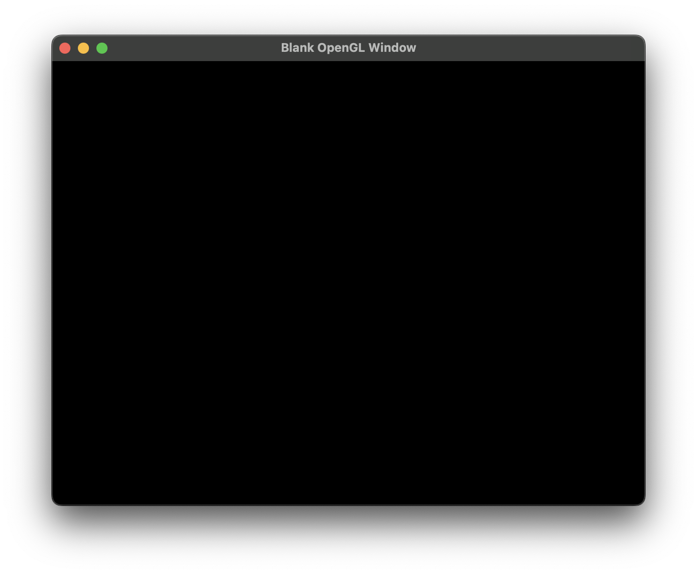

# Blank GLFW Window

## Main Goal
To create a usable .app window for the ARM architecture in MacOS, for MacOS. 

## Why make this project instead of using Swift in Xcode?
It is not commonly known to use this because theres swift. But Xcode is cringe. And way too big. It's just not good and using it requires a segmented mindset and physical environment becuase it requires so much storage and RAM. 

You basically need another MacOS machine for programming on Xcode using swift just to program freely without intefereing with everything else a computer is used for, including the various hobbies or interests that requires physical hardware like; Video Editing, Game Developement (Unreal Engine, Unity, etc), Music (instrumental sounds) and more. 

## Who is this project best for?
- OS: MacOS Seqouia 15.1
- RAM: 8GB
- Storage: Average
- Architecture: Apple Silicon (ARM)

## How to get this project?
### CLI (using HTTPS)
```bash
git clone https://github.com/H12M54AM/blank-opengl-window.git
```
### CLI (using SSH)
```bash
git@github.com:H12M54AM/blank-opengl-window.git
```

## What does the project look like?

Yep... That's it. 

# Resources
Maybe these will help you too :)
- [C++ OpenGL Setup by Codeus - Youtube](https://www.youtube.com/watch?v=Y4F0tI7WlDs)
- [Welcome to OpenGL by The Cherno - Youtube](https://www.youtube.com/watch?v=W3gAzLwfIP0&list=PLlrATfBNZ98foTJPJ_Ev03o2oq3-GGOS2)
- [How to setup GLFW on new Macs by LuTheCoder - Youtube](https://www.youtube.com/watch?v=6AHq0jTrypw&t=471s)